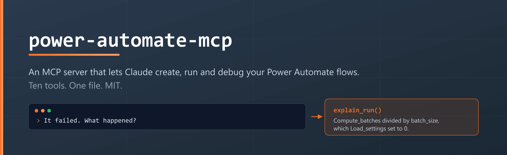
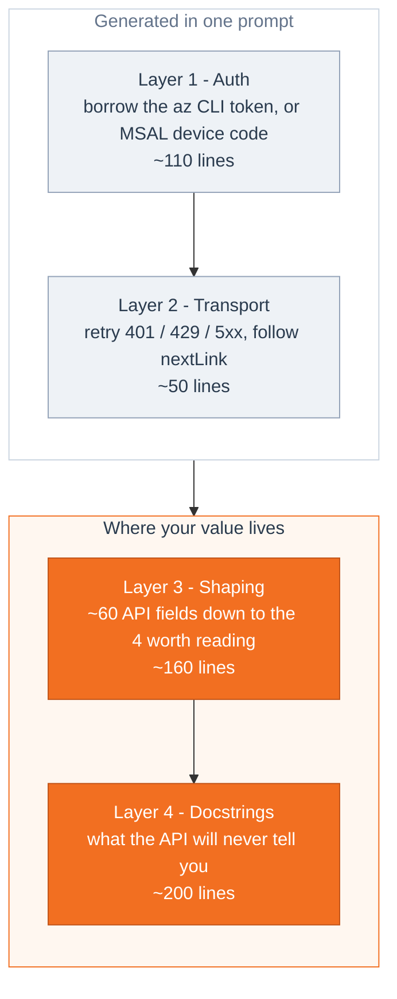
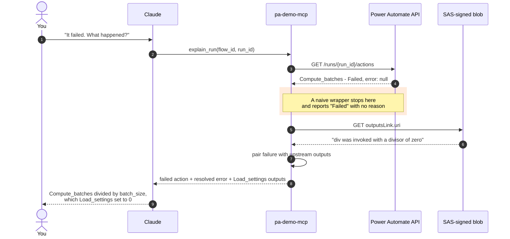
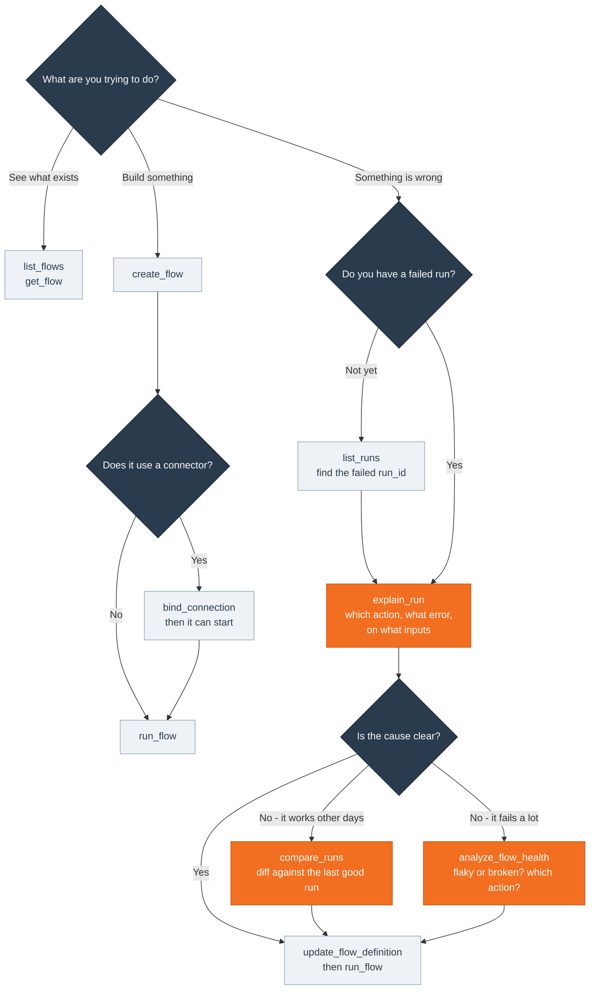
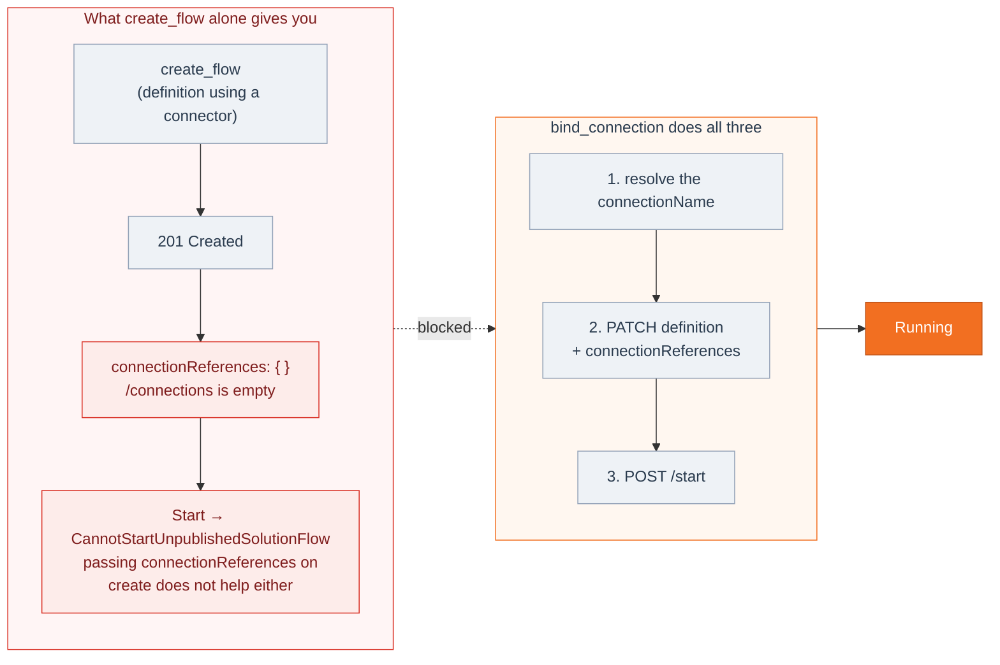
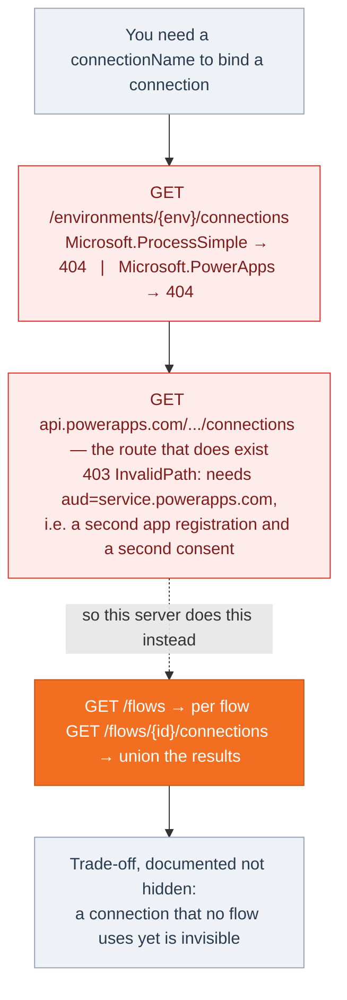

# power-automate-mcp

**An MCP server that lets Claude create, run, and debug your Power Automate flows.**
One file. Ten tools. Built as a teaching artifact for a community talk on why you
should build your own MCP servers instead of waiting for someone to ship you one.

```
> Create a flow from demo-flow.json and run it.

  create_flow  -> DEMO - nightly batch (8a3f...), Started
  run_flow     -> accepted

> It failed. What happened?

  list_runs    -> 08d8...: Failed
  explain_run  -> Compute_batches failed:
                  "The template language function 'div' was invoked with a
                   divisor of zero."
                  Load_settings emitted {"region": "westeurope", "retries": 3,
                  "batch_size": 0} and Compute_batches divides 120 by batch_size.

> Fix it and run it again.

  get_flow                 -> definition retrieved
  update_flow_definition   -> batch_size: 0 -> 4
  run_flow                 -> accepted
  list_runs                -> 08d8...: Succeeded, output 30
```

That entire loop is four tool calls the model chose on its own, because the tools
tell it what they are for.

And when the error is clear but the *reason* is not:

```
> This flow works most days. Why did it fail last night?

  compare_runs        -> diverged at Compute_batches, but Load_settings emitted
                         batch_size: 0 where the working run emitted 4.
                         Symptom and cause are different actions.
  analyze_flow_health -> 18% failure rate over 50 runs, 5 of 5 sampled failures
                         all in Get_items. Flaky and concentrated, not broken.
```

---

## Table of contents

- [Why this exists](#why-this-exists)
- [The tool that justifies the exercise](#the-tool-that-justifies-the-exercise)
- [Quick start](#quick-start)
- [Architecture: the four layers](#architecture-the-four-layers)
- [Tool reference](#tool-reference)
- [Gotchas this server encodes](#gotchas-this-server-encodes)
- [The demo flow](#the-demo-flow)
- [Extending it](#extending-it)
- [Troubleshooting](#troubleshooting)
- [Security](#security)
- [What is deliberately missing](#what-is-deliberately-missing)
- [FAQ](#faq)

---

## Why this exists

Every useful MCP server is four layers. Only two of them are interesting.

| Layer | What it does | Lines here | Who writes it |
| --- | --- | --- | --- |
| **1. Auth** | Get a token | ~45 | Claude, in one prompt |
| **2. Transport** | Call, retry, paginate | ~50 | Claude, in one prompt |
| **3. Shaping** | Turn API JSON into model-readable JSON | ~160 | **You. This is the work.** |
| **4. Docstrings** | Teach the model what the API will not | ~200 | **You. This is the moat.** |



Wrapping an API is not the point, and it is precisely the part you can automate.
The value is in deciding what to hand the model, and in writing down what you
learned so that you never learn it twice.

Two concrete examples from this repo.

**Shaping.** `list_flows` returns four fields per flow. The API returns about sixty,
mostly GUIDs and internal plumbing. Handing the raw payload to a model burns
context, buries the signal, and makes the model slower and less accurate. Deciding
what to drop is a judgement call that no code generator can make for you, because
it depends on what you actually do with flows.

**Docstrings.** `create_flow` documents that a connector flow will fail with HTTP
400 unless the definition declares `$connections` and `$authentication`, and that
the error message blames the *trigger*, which sends you hunting in entirely the
wrong place. That cost real hours to discover once. It now costs nobody anything,
forever, including every future model that reads this docstring.

The code is regenerable. The accumulated knowledge in the docstrings is the asset.

---

## The tool that justifies the exercise

`explain_run` is the tool a generic HTTP wrapper cannot give you, and it is worth
understanding why before you read any other code here.

**Power Automate does not put the error message on the action record.** A failed
action comes back looking like this:

```json
{
  "name": "Compute_batches",
  "properties": {
    "status": "Failed",
    "error": null,
    "outputsLink": {
      "uri": "https://prod-08.westeurope.logic.azure.com/.../contents/ActionOutputs?sv=...&sig=...",
      "contentSize": 285
    }
  }
}
```

`error` is `null`. The real message lives inside a blob behind that short-lived
SAS-signed URL. The portal follows the link for you, which is exactly why the
portal shows you a real error and a naive API wrapper shows you `Failed` and
nothing else.

`explain_run` does two things a wrapper does not:

1. **It follows the link.** For every failed action, it fetches the outputs blob
   and digs the message out, so the model receives resolved error text rather
   than `null`.
2. **It supplies upstream context.** A failure is rarely explained by the failing
   action alone. The cause is almost always in what an earlier action produced.
   So the response pairs each failed action with the outputs of the actions that
   succeeded before it, in execution order.



One tool call. The equivalent of about a dozen clicks through the run history view.
That gap is the entire argument for building your own MCP server.

---

## Quick start

### Prerequisites

- Python 3.10 or later
- A Power Platform environment you can create flows in
- The [Azure CLI](https://learn.microsoft.com/cli/azure/install-azure-cli), signed in
  with `az login`. That is normally the entire auth story - see
  [step 1](#1-authentication-az-login-is-usually-all-you-need) before assuming you
  need to register anything
- An MCP client: Claude Code, Claude Desktop, or anything else that speaks MCP

> **Use a demo or development tenant.** This server creates, edits, and runs real
> flows with your delegated permissions. It can do anything you can do.

### 1. Authentication: `az login` is usually all you need

**You probably do not need to register anything.**

What this server needs is a token for the `https://service.flow.microsoft.com`
audience. The Azure CLI is itself a Microsoft first-party app, already consented in
most tenants, and it will hand you one. So the default path is:

```bash
az login
```

That is the whole setup. Leave `PA_CLIENT_ID` unset and the server borrows the CLI's
token, resolving your default environment from whatever tenant the CLI is signed in
to. No app registration, no admin consent, no device code.

This is the same trick the `Microsoft.PowerApps.PowerShell` module uses when
`Add-PowerAppsAccount` followed by `Get-Flow` lists your flows without you
registering anything.

<details>
<summary><b>Option B: your own app registration</b> (when the CLI route is blocked)</summary>

Being first-party is not automatically sufficient, which is why this is tenant-specific.
Microsoft's own Work IQ CLI app (`ba081686-5d24-4bc6-a0d6-d034ecffed87`) does *not*
carry `service.flow.microsoft.com` in its allowed resources and cannot be extended,
because Microsoft owns it. Conditional Access and pre-authorization policies vary too.

You want your own registration when `az login` is refused for the Flow audience
(a consent error such as `AADSTS65001`), or when the machine has no Azure CLI.
Setting `PA_CLIENT_ID` switches the server to device-code auth automatically.

In the [Microsoft Entra admin center](https://entra.microsoft.com):

1. **App registrations > New registration.**
   - Name: anything, for example `power-automate-mcp`
   - Supported account types: **Accounts in this organizational directory only**
   - Redirect URI: leave empty, device code flow does not use one
   - Click **Register**

2. **Authentication > Advanced settings > Allow public client flows: Yes.**
   Device code authentication silently fails without this. It is the single most
   common setup mistake.

3. **API permissions > Add a permission > APIs my organization uses.**
   Search for **Power Automate service** (it also appears as *Flow Service*).
   Choose **Delegated permissions** and add:
   - `Flows.Read.All` (Read flows)
   - `Flows.Manage.All` (Manage flows)

   > If "Power Automate service" does not appear in the picker, the service
   > principal does not exist in your tenant yet. Sign in once at
   > [make.powerautomate.com](https://make.powerautomate.com) with any user in
   > that tenant, then search again.

4. **Grant admin consent** for your organization.

5. From **Overview**, copy the **Application (client) ID** and the
   **Directory (tenant) ID**. Put them in `PA_CLIENT_ID` and `PA_TENANT_ID`.

</details>

### 2. Install

```bash
git clone https://github.com/OwnOptic/power-automate-mcp.git
cd power-automate-mcp
pip install -r requirements.txt
```

Four dependencies: `mcp`, `msal`, `httpx`, `python-dotenv`.

### 3. Configure

**On the `az login` path there is nothing to configure.** Every variable is optional;
the server resolves your tenant and default environment from the Azure CLI. Skip to
step 4.

To target a specific environment, or to use your own app registration, copy
`.env.example` to `.env`:

```ini
# All optional.
# Unset PA_CLIENT_ID = az mode. Set it = device-code mode.
# PA_CLIENT_ID=<Application (client) ID>
# PA_TENANT_ID=<Directory (tenant) ID>

# Target a specific environment instead of the tenant default.
# PA_ENV_ID=Default-00000000-0000-0000-0000-000000000000
```

Which mode you are in is visible at a glance: `AUTH_MODE` is `az` unless
`PA_CLIENT_ID` is set.

Neither value is a secret. There is no client secret in this design at all: both
modes are public-client delegated auth. The only credential involved is a refresh
token, held by the Azure CLI in az mode, or cached in `.token_cache.json` in
device-code mode. That file and `.env` are both gitignored.

**Finding your environment ID.** The default environment is `Default-<tenant-id>`
and is used automatically. To target a different one, open
[make.powerautomate.com](https://make.powerautomate.com), switch to the
environment, and read the GUID out of the URL.

### 4. Connect it to your client

**Claude Code** - add to `.mcp.json` in your project root, or to your user config:

```json
{
  "mcpServers": {
    "power-automate": {
      "command": "python",
      "args": ["C:/path/to/power-automate-mcp/server.py"]
    }
  }
}
```

**Claude Desktop** - same block, in `claude_desktop_config.json`:
- Windows: `%APPDATA%\Claude\claude_desktop_config.json`
- macOS: `~/Library/Application Support/Claude/claude_desktop_config.json`

Use an absolute path to `server.py`. The server resolves `.env` relative to its own
file, so the working directory does not matter.

### 5. Sign in

**az mode:** you already did, with `az login`. Nothing further.

The CLI's own refresh token is subject to your tenant's Conditional Access policy,
so a long-lived session can expire on you. If a tool starts returning
`AADSTS70043 token_expired`, run `az login` again.

<details>
<summary><b>Device-code mode</b> (only when PA_CLIENT_ID is set)</summary>

The first tool call triggers device-code auth. A message like this appears in the
MCP server log:

```
To sign in, use a web browser to open the page https://microsoft.com/devicelogin
and enter the code A1B2C3D4E to authenticate.
```

Open the page, paste the code, sign in. MSAL then writes a refresh token to
`.token_cache.json` and you stay silent for roughly 90 days.

> If you cannot see the server log, run `python server.py` directly in a terminal
> once to complete the sign-in, then start it through your MCP client.

</details>

### 6. Verify

Ask your client:

```
List my flows.
```

You should get back flow IDs, display names, and states. If you do, all four layers
are working.

Then run the full demo:

```
Create a flow called "DEMO - nightly batch" using the definition in
demo-flow.json, then run it and tell me what happened.
```

---

## Architecture: the four layers

The whole server is [`server.py`](server.py), deliberately kept in one file so it
can be read top to bottom in a few minutes. The four layers appear in order.

### Layer 1: Auth (`_az_access_token`, `_client`, `_token`)

Two token sources behind one `_token()`, selected by whether `PA_CLIENT_ID` is set.
Nothing in it is Power Automate specific. Change `PA_RESOURCE` and this is a
Microsoft Graph client, or a Dataverse client, or an Azure Resource Manager client.

```python
PA_RESOURCE = "https://service.flow.microsoft.com"
SCOPES = [f"{PA_RESOURCE}/.default"]
AUTH_MODE = "msal" if CLIENT_ID else "az"
```

The `/.default` form means "whatever this client has already been consented for",
which avoids `AADSTS65001` errors from requesting individual scopes that lack consent.

**az mode is the interesting one, and it is four lines of real work:** shell out to
`az account get-access-token --resource <audience>`, cache the result, done. You are
borrowing a Microsoft first-party app that your tenant already trusts, which removes
the registration, the consent, and the device-code dance in one move. When you build
an MCP server against any Azure-fronted API, try this before you go near the Entra
portal.

The trade-off is that the Azure CLI's session lives under your tenant's Conditional
Access policy, so it can expire mid-session in a way an MSAL cache would not. Hence
both modes existing rather than only the convenient one.

One design note worth copying: **the MSAL client is built lazily, not at import.**
MSAL performs OIDC discovery against the tenant when you construct it, so building
it at import time means a wrong tenant ID or dropped network connection kills the
server before it registers a single tool, and your client reports nothing more
useful than "server failed to start". Constructed lazily, the same failure surfaces
as a readable error message inside a tool result.

### Layer 2: Transport (`_call`, `_list`)

One request helper handling the four things that always come up:

- **401** once, with a force-refreshed token, then retry
- **429** with `Retry-After` honoured
- **503 / 504** with exponential backoff
- **Terminal errors** re-raised carrying the API's own message, because the model
  can frequently act on it directly

Plus `_list`, which follows `nextLink` for collection endpoints up to a cap.

```
BASE        https://api.flow.microsoft.com/providers/Microsoft.ProcessSimple
api-version 2016-11-01
```

### Layer 3: Shaping (`_flow_summary`, `_run_summary`, `_resolve_error`, `_trim`)

Where the judgement lives. Every tool returns a hand-picked subset of the API
response.

The rule of thumb: **if you would not read the field while debugging, the model
does not need it either.**

`_trim` caps any single field at 2000 characters so one enormous action payload
cannot blow up the context window. `_resolve_error` is the SAS-blob second hop
described above.

### Layer 4: Tools and docstrings

Seven `@mcp.tool()` functions. The docstrings are not documentation for humans,
they are the prompt the model reads to decide what to call and how. They carry:

- what the tool returns and which field feeds which other tool
- the API's non-obvious constraints
- the failure modes and what they actually mean
- explicit instructions such as "look connector operationIds up on Microsoft Learn
  rather than guessing"

**Everything you get wrong twice belongs in a docstring.** That is the practice
this repo is arguing for.

---

## Tool reference

Ten tools in three groups.

| Group | Tools |
| --- | --- |
| **Author** | `list_flows`, `get_flow`, `create_flow`, `update_flow_definition`, `bind_connection` |
| **Operate** | `run_flow`, `list_runs` |
| **Diagnose** | `explain_run`, `compare_runs`, `analyze_flow_health` |

Which one to reach for:



### `list_flows(state="", top=25)`

List flows in the environment.

| Parameter | Type | Default | Notes |
| --- | --- | --- | --- |
| `state` | str | `""` | Filter on `Started` or `Stopped`. Empty returns all. |
| `top` | int | `25` | Maximum flows to return. |

Returns a list of `{flow_id, display_name, state, modified}`. Use `flow_id` with
every other tool.

### `get_flow(flow_id)`

Get one flow with its complete definition, the JSON behind the designer's Code view.

Returns `{flow_id, display_name, state, modified, triggers, actions, definition}`
where `triggers` and `actions` are name lists for quick scanning and `definition`
is the full dict.

Call this before `update_flow_definition`: the API has no partial update semantics,
so you must send the entire definition back with your modification applied.

### `create_flow(display_name, definition, start=True)`

Create a flow from a workflow-definition dict.

| Parameter | Type | Default | Notes |
| --- | --- | --- | --- |
| `display_name` | str | required | Name shown in the portal. |
| `definition` | dict | required | Needs at least `triggers` and `actions`. |
| `start` | bool | `True` | `False` creates it stopped, required for connector flows. |

See [Gotchas](#gotchas-this-server-encodes) for the two rules that make the
difference between a 201 and an afternoon of confusion.

### `update_flow_definition(flow_id, definition, connection_references=None)`

Replace a flow's definition. Send the complete definition, not a fragment.

`connection_references` is required for connector flows and is shaped like:

```json
{
  "shared_office365": {
    "connectionName": "shared-office365-8f3a...",
    "source": "Embedded",
    "id": "/providers/Microsoft.PowerApps/apis/shared_office365"
  }
}
```

Does not work on portal-bound flows. See [Gotchas](#gotchas-this-server-encodes).

### `bind_connection(flow_id, connector, connection_name="", start=True)`

Bind an existing connection to a flow and start it. **The missing step of `create_flow`.**

| Parameter | Type | Default | Notes |
| --- | --- | --- | --- |
| `flow_id` | str | required | The flow to bind. |
| `connector` | str | required | Logical name, e.g. `shared_office365`, `shared_teams`. |
| `connection_name` | str | `""` | Concrete connection id. Empty means auto-resolve. |
| `start` | bool | `True` | Start the flow once bound. |

`create_flow` returns 201 but leaves `connectionReferences` empty, so a connector
flow cannot be started. Binding is a separate PATCH that must carry both the full
definition *and* the connection reference. This tool does the whole sequence in one
call: resolve the connection, PATCH definition plus reference, start the flow.

Returns one of four statuses:

| `status` | Meaning |
| --- | --- |
| `bound` | Success. Check `connections_on_flow` is at least 1. |
| `ambiguous` | Several connections match this connector. Candidates returned; re-call with `connection_name`. |
| `not_found` | No connection for this connector is visible. Create it in the portal first. |
| (raises) | Portal-bound flow, or the flow does not exist. |

It deliberately does **not** guess when several connections match, because binding
the wrong account is a silent failure you would discover in production.

> The connection must already exist. No API reachable with a Flow token can create
> and authenticate a new connection. That is a portal action, permanently.

### `run_flow(flow_id, trigger_name="manual", inputs=None)`

Trigger a flow immediately rather than waiting for its schedule. Requires flow
ownership.

`trigger_name` is the trigger's internal name from `get_flow`. It is `manual` for
button flows, which is why the demo flow uses a button trigger.

Returns immediately. The run is asynchronous, so poll `list_runs` for the outcome.

> For `Request` / HTTP-trigger flows this management endpoint does **not** forward
> a body, so `@triggerBody()` evaluates to `null`. Call the flow's real HTTP URL if
> it depends on its payload.

### `list_runs(flow_id, status="", top=10)`

Recent runs, newest first.

| Parameter | Type | Default | Notes |
| --- | --- | --- | --- |
| `status` | str | `""` | `Succeeded`, `Failed`, `Cancelled`, `Running`. |
| `top` | int | `10` | Capped at 100 by the API. |

Returns `{run_id, status, start_time, end_time, error}`. Feed a failed `run_id`
straight into `explain_run`.

### `explain_run(flow_id, run_id)`

Diagnose a run. The reason this repo exists.

Returns:

```json
{
  "run_id": "08d8...",
  "status": "Failed",
  "started": "2026-08-04T14:22:01Z",
  "failed_actions": [
    {
      "name": "Compute_batches",
      "status": "Failed",
      "error": "The template language function 'div' was invoked with a divisor of zero.",
      "inputs": "..."
    }
  ],
  "succeeded": [
    {
      "name": "Load_settings",
      "status": "Succeeded",
      "outputs": {"region": "westeurope", "retries": 3, "batch_size": 0}
    }
  ],
  "hint": "Compute_batches failed. Its error is resolved above; check the outputs of the succeeded actions for the value that caused it."
}
```

If `failed_actions` is empty while `status` is `Failed`, the failure was in the
**trigger**, not the body. Inspect the trigger's condition and inputs.

> SAS URLs expire. Debugging a run from several days ago may return
> `[error blob unavailable]`. Re-run the flow to produce a fresh failure.

### `compare_runs(flow_id, failed_run_id, baseline_run_id="")`

Diff a failed run against a working one.

Use this when `explain_run` gives you an error that is technically clear but does not
explain why *this* run differed: intermittent failures, "it worked yesterday",
data-dependent bugs. `baseline_run_id` is optional; left empty the tool finds the
most recent `Succeeded` run itself.

```json
{
  "failed_run": "08d8...",
  "baseline_run": "08d7...",
  "diverged_at": "Compute_batches",
  "status_changes": [
    { "action": "Compute_batches", "baseline": "Succeeded", "failed": "Failed" }
  ],
  "output_changes": [
    { "action": "Load_settings", "baseline": {"batch_size": 4}, "failed": {"batch_size": 0} }
  ],
  "only_in_failed": [],
  "only_in_baseline": []
}
```

Read it in this order: `diverged_at` tells you where the run broke, and
`output_changes` usually tells you *why*. Above, the run diverged at
`Compute_batches` but the cause is upstream in `Load_settings`, whose output changed
from 4 to 0. Symptom and cause are different actions, which is the normal case.

`only_in_failed` and `only_in_baseline` being non-empty means a condition or branch
evaluated differently between the two runs.

> If `output_changes` is empty and the same action failed in both runs, the failure is
> deterministic. The fix is in the definition, not the data.

Output comparison uses `contentSize` when outputs are behind a `outputsLink` URI,
since the URIs themselves differ per run by design and would otherwise always
compare as changed.

### `analyze_flow_health(flow_id, last_n=50, sample_failures=5)`

Analyse recent run history: reliability, failure patterns, duration.

| Parameter | Type | Default | Notes |
| --- | --- | --- | --- |
| `last_n` | int | `50` | Runs included in the statistics. |
| `sample_failures` | int | `5` | Failed runs opened for action-level attribution. |

```json
{
  "runs_analysed": 50,
  "Succeeded": 41, "Failed": 9, "Cancelled": 0, "Running": 0,
  "failure_rate": 0.18,
  "duration_seconds": { "mean": 4.21, "p95": 11.80, "max": 14.02 },
  "failures_sampled": 5,
  "failing_actions": [
    { "action": "Get_items", "count": 5, "sample_error": "The response is not in a JSON format." }
  ],
  "verdict": "Flaky, concentrated in 'Get_items' - that one action explains almost every failure."
}
```

Action-level detail costs one request per run, so only `sample_failures` of the failed
runs are opened. **`failing_actions` is a sample, not an exhaustive tally**, and the
response states how many runs it came from so you can see that for yourself.

The `verdict` distinguishes the two cases that call for different responses: failures
concentrated in one action mean a targeted fix, while failures spread across many
actions usually mean the trigger data or a connection rather than the logic.

---

## Gotchas this server encodes

These are the hours this repo saves you. Each one is also written into the relevant
docstring so the model sees it at call time, which is the entire point.

### 1. Failed actions carry `error: null`

Covered [above](#the-tool-that-justifies-the-exercise). The message is in a
SAS-signed blob at `outputsLink.uri`. `explain_run` follows it.

### 2. Connector flows need the two magic parameters

If **any** trigger or action is an `OpenApiConnection`,
`OpenApiConnectionWebhook`, or `OpenApiConnectionNotification`, the definition
must declare, at top level alongside `triggers` and `actions`:

```json
"parameters": {
  "$connections":    { "defaultValue": {}, "type": "Object" },
  "$authentication": { "defaultValue": {}, "type": "SecureObject" }
}
```

Omit them and creation fails with HTTP 400 stating that the *trigger* is missing
`$authentication`. That message is misleading: there is no trigger-versus-action
asymmetry, connector triggers and connector actions both fail identically without
the block. Add only `$authentication` and it then complains about `$connections`.

They are harmless on connector-free flows, so just always include them.

### 3. Creating a flow does not bind its connections

A `201 Created` gives you a flow whose `connectionReferences` is `{}`, whose
`/connections` endpoint is empty, and which cannot be turned on:

```
CannotStartUnpublishedSolutionFlow: Please authenticate the flow connections
and save the flow to enable activation.
```

Passing `connectionReferences` on the create call does not help. The service
rewrites it into a solution-style `connectionReferenceLogicalName` binding that
stays unstartable.

The working headless sequence for a non-solution flow reusing a connection that
already exists in the environment:

1. `create_flow(..., start=False)`
2. `update_flow_definition(flow_id, definition, connection_references={...})`
3. Start the flow

**`bind_connection` does all three in one call**, which is exactly the kind of thing
your own MCP server should absorb. An API that requires a three-step dance to reach a
working state is an API whose tool layer should expose the destination, not the dance.



Nothing in any of these APIs can create and authenticate a brand new connection.
Make that one in the portal first.

### 4. Portal-bound flows cannot be updated through this API

Once the maker portal binds a flow's connections they become Dataverse connection
references, and there is a read/write shape mismatch that cannot be reconciled from
here:

- `get_flow` reports the host as `connectionName`
- the PATCH wants `connectionReferenceName`
- supplying `connectionReferenceName` fails with "connection reference could not be
  found", because minting the Dataverse reference is not possible through this
  endpoint

Edit those flows in the portal. Headless creation plus binding works only for flows
whose connections you also created here.

### 5. There is no environment-wide connections endpoint you can reach

This one is worth reading even if you never touch Power Automate, because it is the
purest example of why a hand-built tool layer beats a generated one.

To bind a connection you need its `connectionName`. The obvious way to get it is to
list the environment's connections. You cannot:

- `/environments/{env}/connections` returns **404** under the `Microsoft.ProcessSimple`
  provider **and** under `Microsoft.PowerApps`
- the route that does work lives on a different host entirely,
  `https://api.powerapps.com/providers/Microsoft.PowerApps/environments/{env}/connections`
- calling it with a `service.flow.microsoft.com` token returns **403 InvalidPath**,
  because it needs an `aud=service.powerapps.com` token, meaning a second app
  registration and a second admin consent

The per-flow route `/environments/{env}/flows/{flow_id}/connections` *does* work. So
this server discovers connections by walking the environment's flows and unioning what
they reference.

The trade-off is real and is documented rather than hidden: **a connection that no flow
uses yet is invisible.** For the question that actually matters, "is connector X already
connected here and what is its `connectionName`", any bindable connection is normally
referenced by at least one flow.



No code generator produces that workaround. It only exists because someone hit the 404,
then hit the 403, then found the flow-scoped route.

### 6. Never inline a secret in a definition

Flow definitions are stored in plaintext on the flow artifact. An API key written
into a definition is readable by anyone with access to the flow. Use a Power
Platform environment variable or a Key Vault reference and resolve it at runtime.

### 7. Look connector operationIds up, do not guess them

Connector actions need the exact `operationId` and the exact parameter names.
Guessing produces a flow that saves cleanly and fails at runtime, which is the
worst possible failure mode. Search
[Microsoft Learn connector reference](https://learn.microsoft.com/connectors/) for
the connector, or read the definition of a working flow built in the portal.

A representative example of how non-obvious these get: the Teams "post adaptive
card and wait for a response" action is `PostCardAndWaitForResponse`, its
parameters use a doubled prefix (`body/body/messageBody`), and the `submitActionId`
it returns is the **title** of the button the user clicked rather than the button's
`data` payload.

---

## The demo flow

[`demo-flow.json`](demo-flow.json) is deliberately broken, and deliberately
connector-free.

```json
"Load_settings":   { "type": "Compose", "inputs": { "batch_size": 0, ... } },
"Compute_batches": { "type": "Compose", "inputs": "@div(120, outputs('Load_settings')['batch_size'])" }
```

`Load_settings` emits `batch_size: 0`. `Compute_batches` divides by it. The run
fails at the second action, and the reason is visible only in the first action's
output, which is precisely the shape `explain_run` is built to handle.

It uses a **button trigger plus two Compose actions**, so it involves no connector
at all. That means it creates and starts headlessly with no connection binding,
sidestepping gotchas 2 and 3 entirely. If you are building your own demo, copy that
choice: connector-free flows are the only ones you can reliably create end to end
from an API.

---

## Extending it

Adding a tool takes three steps.

1. **Find the endpoint.** The Power Automate management API is the
   `Microsoft.ProcessSimple` provider. Browser devtools on
   make.powerautomate.com is an effective way to discover the exact shape of a
   call the portal makes.

2. **Write the shaping function.** Call the endpoint once, look at the response,
   and decide what is worth the model's context. Be aggressive. You can always
   add a field back.

3. **Write the docstring like a prompt.** State what it returns, which field feeds
   which other tool, and every constraint you discovered while building it.

```python
@mcp.tool()
def resubmit_run(run_id: str, flow_id: str) -> dict:
    """Re-run a failed run with its ORIGINAL trigger payload.

    Different from run_flow: this replays the exact data that caused the failure,
    which is what you want after fixing a definition. run_flow starts a fresh run
    with no payload and will not reproduce the case you just fixed.

    Returns a new run_id. Poll list_runs, then explain_run if it fails again.
    """
    return _call("POST", f"/environments/{ENV_ID}/flows/{flow_id}/runs/{run_id}/resubmit")
```

Note what that docstring spends its words on: not what the tool does, but **when to
use it instead of the tool next to it.** Disambiguating two similar tools is the
highest-value sentence you can write, because choosing wrong between them is the
mistake a model actually makes.

Natural next additions, roughly in order of usefulness: `resubmit_run`,
`list_environments`, `get_trigger_url`, `delete_flow`, `list_solutions`.

---

## Troubleshooting

| Symptom | Cause | Fix |
| --- | --- | --- |
| `AADSTS70043 token_expired` | Azure CLI session aged out under a Conditional Access sign-in-frequency policy | `az login` again |
| `Azure CLI call failed ... az: command not found` | No Azure CLI on this machine | Install it, or set `PA_CLIENT_ID` to use device-code mode instead |
| Tools work but hit the wrong tenant | `az` is signed in somewhere else | `az account show` to check, `az login --tenant <id>` to move |
| `AADSTS7000218` or device flow returns no `user_code` | Public client flows disabled | Entra > your app > Authentication > Allow public client flows: **Yes** |
| `AADSTS65001` consent error | App permissions not admin-consented | Grant admin consent on the app registration |
| `AADSTS90002 Tenant not found` | Wrong `PA_TENANT_ID` | Copy the Directory (tenant) ID from the app's Overview page |
| "Power Automate service" missing from the API picker | Service principal not provisioned in the tenant | Sign in once at make.powerautomate.com, then retry |
| `403` on every call | Delegated permissions missing or not consented | Add Read flows + Manage flows, grant admin consent, delete `.token_cache.json`, sign in again |
| `404` on a flow you can see in the portal | Wrong environment | Set `PA_ENV_ID` to the environment GUID from the maker portal URL |
| Create returns 400 about `$authentication` | Magic parameters missing | See [gotcha 2](#2-connector-flows-need-the-two-magic-parameters) |
| `CannotStartUnpublishedSolutionFlow` | Connections not bound | See [gotcha 3](#3-creating-a-flow-does-not-bind-its-connections) |
| `explain_run` returns `[error blob unavailable]` | SAS URL expired | Re-run the flow and debug the fresh failure |
| `bind_connection` returns `not_found` | Connection does not exist, or no flow references it yet | Create and authenticate it in the portal, or use it on one flow first |
| `bind_connection` returns `ambiguous` | Several connections for that connector | Re-call with `connection_name` set to one of the returned candidates |
| `bind_connection` succeeds but `connections_on_flow` is 0 | Flow is solution or portal-bound | Edit that flow in the portal, see [gotcha 4](#4-portal-bound-flows-cannot-be-updated-through-this-api) |
| `analyze_flow_health` returns `duration_seconds: null` | No successful runs to measure | Expected on a flow that has never succeeded |
| `@triggerBody()` is null when using `run_flow` | Management endpoint does not forward bodies | Call the flow's real HTTP trigger URL instead |
| Stuck asking for a device code repeatedly | Corrupt token cache | Delete `.token_cache.json` and sign in again |

---

## Security

- **No client secret, in either mode.** In az mode the credential at rest belongs to
  the Azure CLI and this repo never touches it. In device-code mode it is the MSAL
  refresh token in `.token_cache.json`, which is gitignored. Treat that file like a
  password: it grants your Power Automate access to anyone who holds it.
- **The server acts as you.** Every call uses your delegated permissions, so it can
  do anything you can do in that environment, including deleting work. Point it at
  a demo tenant.
- **`.env` holds no secrets** by design. A client ID and tenant ID are public
  identifiers. It is gitignored anyway, because environment IDs leak tenant
  structure.
- **Write tools are live.** `create_flow`, `update_flow_definition`, and `run_flow`
  change real state with no confirmation step. If you want this in a production
  tenant, split the read tools and write tools into two servers and connect the
  write server only when you mean it.
- **Never inline secrets in flow definitions.** See
  [gotcha 6](#6-never-inline-a-secret-in-a-definition).

---

## What is deliberately missing

This is a teaching artifact, not a complete client. Left out on purpose: environment
discovery, solution-bound flow editing, HTTP trigger URL retrieval, resubmit and
cancel, desktop flows, and approvals.

Ten tools is about the number that fits in a talk while still covering a real loop:
author, bind, run, diagnose. The production server this was extracted from runs
twenty-one Power Automate tools alongside Microsoft Graph and Teams, and it is the
same four layers throughout.

---

## FAQ

**Why not just use an official Power Platform MCP server?**
Use one when it covers you. The reason to build your own is layer 4: no vendor can
know that *your* connector always fails *this* way in *your* environment. You also
frequently want three different APIs behind one server, which nobody ships for you.

**Did Claude write this?**
Layers 1 and 2, yes, essentially first try. Layers 3 and 4 are hand-written, because
they encode things the API does not document and a model could not know. That split
is the entire argument.

**How long did it take?**
The seven tools are an evening. The docstrings are months of hitting the same walls
repeatedly. That is the honest answer, and it is the more useful one.

**Can I use this against a production tenant?**
Technically yes, and you should think hard first. See [Security](#security).

**Does this work with Copilot Studio, Dataverse, or Azure DevOps?**
Same four layers, different base URL and scope. Swap those two constants and the
structure holds unchanged. That is why the file is organised the way it is.

**Why one file instead of a package?**
So it can be read top to bottom in five minutes. A real server should be split into
modules. This one is optimised for being understood, not extended.

---

Built by [Elliot Margot](https://e-margot.ch) - Microsoft MVP, M365 Copilot and
Copilot Studio. Licensed [MIT](LICENSE).
